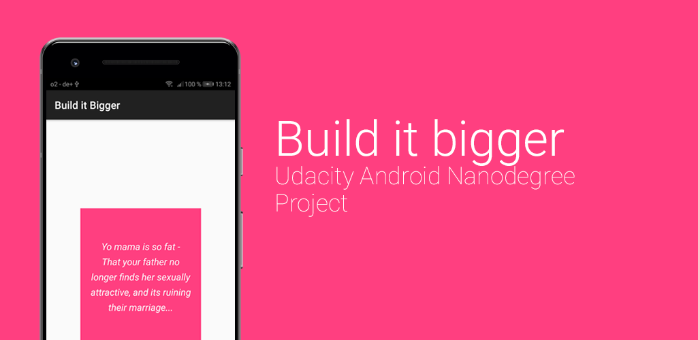

## Project Overview
The complete the **Build it bigger** app.

## What i did
- Updated Gradle
- Created a Java lib. that provides jokes
- Created a Android lib. that displays a jokes
- Implemented Google Cloud Endpoints
- Added Tests for the Async task
- Added a Paid version without Ads 
- Improved the UI

